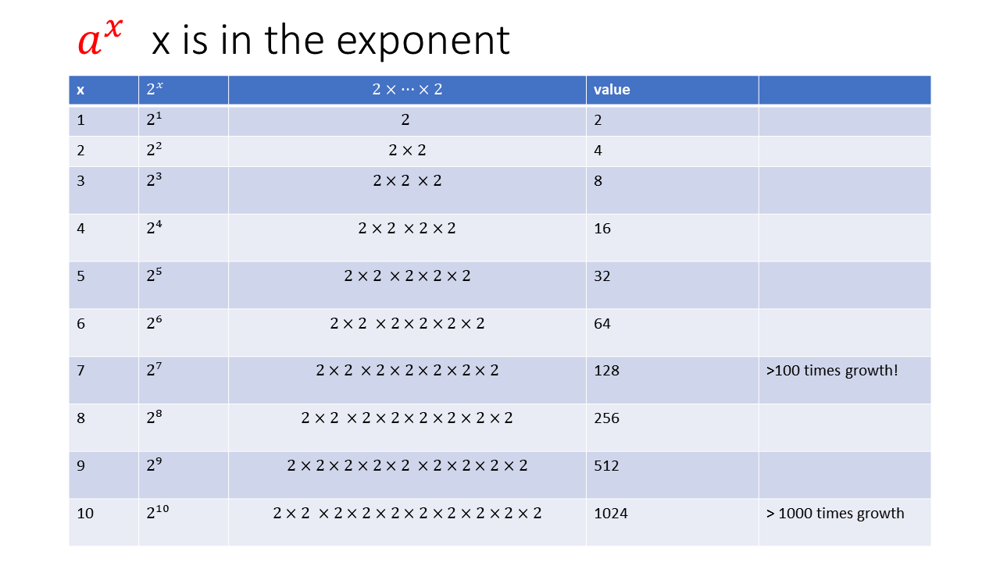

# Characteristics of Exponential Functions

we call functions like this "exponential" because _x_ is in the exponent

## 1% or 10% or 100% interest… does it change the picture?

When you put your money in the bank… of course it matters.

In the big scheme of things there is no difference as long as we take a number greater than one and keep multiplying it with itself repeatedly we see a similar curve:

.png>)
