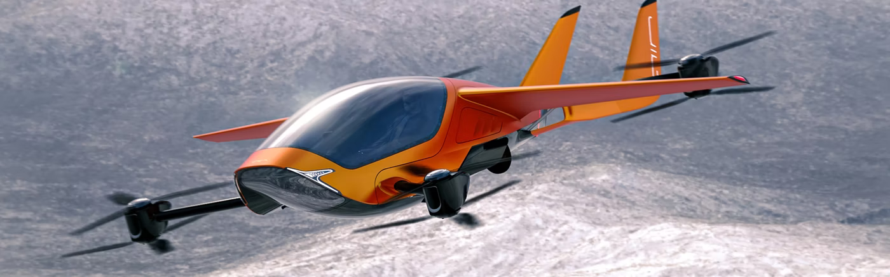

# Flying Cars

I suppose _flying cars_ count as a special case of drones.

eVTOL stands for **E**lectric - **V**ertical **T**ake-**O**ff and **L**anding.\
Some are autonomous, some are piloted and assisted by automation.


XPENG


.png>)


[https://youtu.be/6mbir6u\_AHo](https://youtu.be/6mbir6u\_AHo)



[https://youtu.be/dOhM9xlwOKE](https://youtu.be/dOhM9xlwOKE)


.png>)


[https://www.jobyaviation.com/](https://www.jobyaviation.com)



[https://www.jetsonaero.com/](https://www.jetsonaero.com)



[https://opener.aero/](https://opener.aero)


 (1).png>)


[https://www.bellwether-industries.com/](https://www.bellwether-industries.com)


.png>)

[Uber Air | Uber ElevateAnnounced December 2020, Joby Aviation will acquire Uber Elevate. The two parent companies have agreed to integrate their respective services into each other's apps, enabling seamless integration between ground and air travel for future customers. This deal allows Uber to deepen our partnership with Joby and accelerate the path to market for these technologies and moves the Elevate team to Joby.](https://www.uber.com/ca/en/elevate/)


