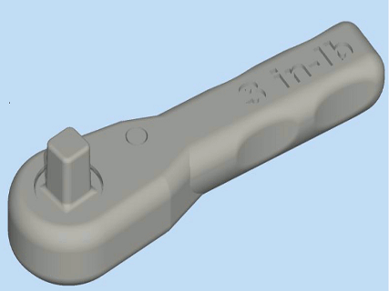

# 🚧 3D Printing, Additive Manufacturing

When you shoot a spaceship into space the rocket can only carry so much weight. Astronauts need careful planning to make sure they will have all the equipment they might need.

International Space Shuttle (ISS) commander Barry 'Butch' Wilmore needed a wrench. They did not have it with them and waiting for a resupply mission is kind of time consuming, not to mention expensive.

This is where the awesomeness of 3D printing comes in. You can just email someone a physical object.

Fortunately, the ISS had a 3D printer on board, design specifically for zero gravity environment by the company, Made in Space. And they printed the wrench.



3D printing has another benefit, it can create geometries that would be hard or impossible to make with traditional manufacturing that is usually subtractive - it removes material. 3D printing is **additive** manufacturing. It builds up objects layer by layer.n

While usual consumer 3D printers just work with cheap PLAplastic... this technology has matured to suite industrial production.

The choice of materials is broad:

different plastics, resins, metals - aluminum, titanium, stainless steel, ceramics, wood, carbon fiber, paper, wax

You can have it be flexible or conductive, full color, medical grade or jewlery.
